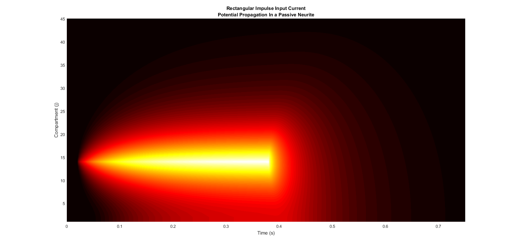
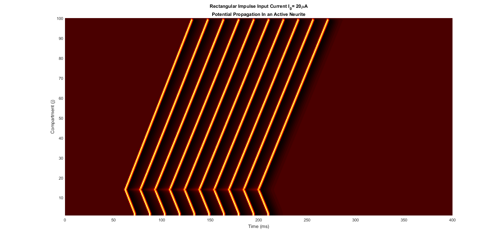
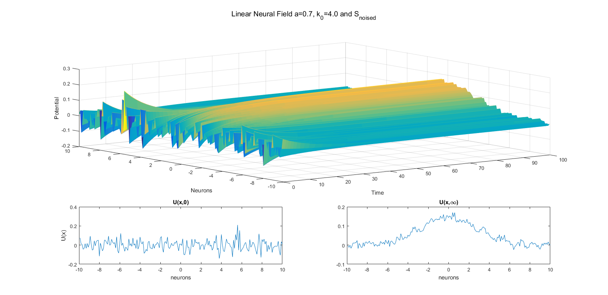
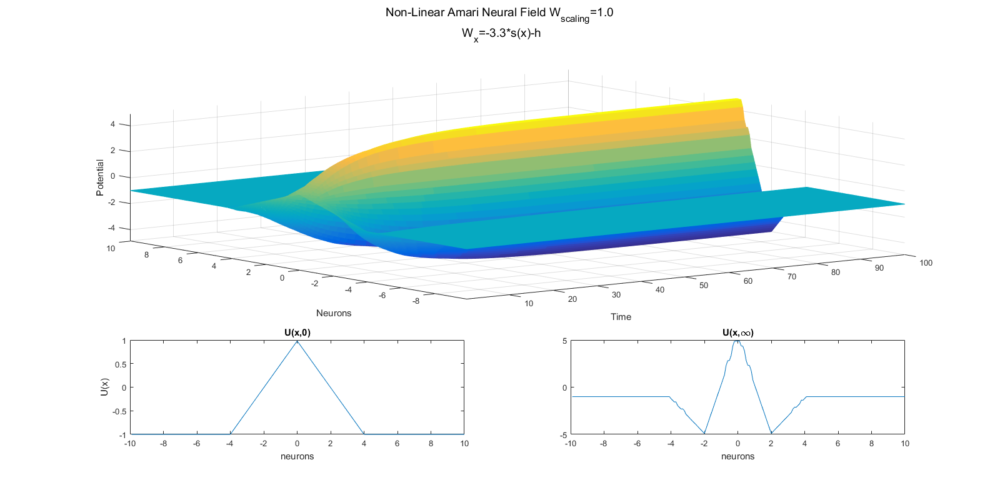

# Neural Dynamical Systems
###### Quoting the Lecture Description:
"The activity patterns of neurons result from complex dynamic interactions between many neurons, or compartments of individual neurons in the nervous system. Neural models try to capture the fundamental properties of such dynamical processes and, making them accessible for mathematical analysis and computer simulation. This course treats the basic biophysics of the signal generation and transmission in neurons and discusses how the underlying physical and physiological phenomena can be approximated by mathematical models. Typically, such models can be characterized as nonlinear dynamical systems. The course provides a systematic introduction in the mathematical theory of linear and nonlinear dynamical systems, and demonstrates how these mathematical methods can be applied to analyze fundamental properties of neurons and neural networks. This framework provides a deeper understanding of fundamental phenomena neural structures, such as passive and active signal propagation, active pattern formation and decision, and basic properties of oscillations and synchronization in neural systems." [Prof. Dr. Giese, Martin A.]

## Passive Neurite Simulations 
[Code in Matlab](MultiPassiveNeurite.m)

Simulation of multi compartment model of passive neurite

Simulation code for single and double compartment model is also available.

## Active Neurite Simulations
[Code in Matlab](MultiActiveNeurite.m)

Simulation of multi compartment Hodgkin-Huxley (HH) model of active neurite

# Predicted time course of differnt parameters by HH model 
[Watch in YouTube!](https://www.youtube.com/watch?v=TYqxIPV0ua0)

## Dynamical Neural Fields
[Code in Matlab](ND09NeuralFeilds.m)

Linear Neural Field Defined Over the Infinite Spatial Domain

Nonlinear Neural Field of Amari Type

